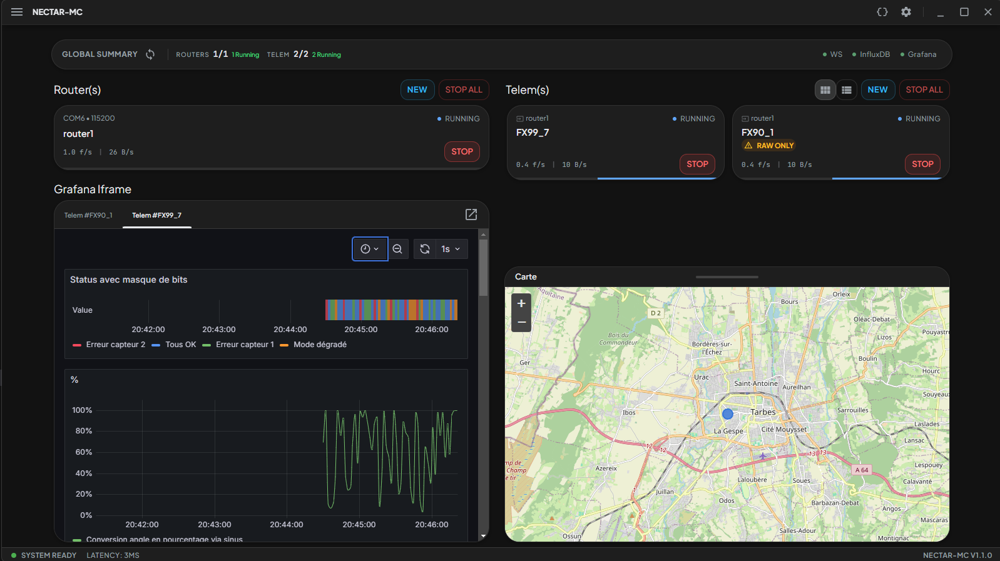

# NECTAR-MC — Releases

> **Logiciel sol de télémétrie pour fusées et systèmes embarqués**

---

## Français

### Qu'est-ce que NECTAR-MC ?

**NECTAR-MC** est un acronyme :

| Lettre | Signification |
|--------|---------------|
| **N** | **N**ode for |
| **E** | **E**xtraction, |
| **C** | **C**onversion, |
| **T** | **T**elemetry, |
| **A** | **A**nalysis and |
| **R** | **R**outing — |
| **M** | **M**ission |
| **C** | **C**ontrol |

**NECTAR-MC** (Ground Control Software) est un logiciel de station sol conçu pour les équipes travaillant sur des fusées ou des systèmes embarqués, **sans nécessiter de profil développeur**. Son objectif : recevoir des trames de télémétrie envoyées par votre système embarqué, les décoder automatiquement, enregistrer les données et les afficher sous forme de tableaux de bord clairs et en temps réel.



Concrètement, NECTAR-MC vous permet de :

- **Recevoir la télémétrie** depuis un port série, un WebSocket ou un fichier — sans toucher à une ligne de code.
- **Configurer le décodage de vos trames** via des fichiers de définition BDS (Binary Data Scheme), un format simple décrivant la structure de vos données.
- **Visualiser vos données en direct** dans des dashboards automatiquement générés sous **Grafana** — vitesse, altitude, température, accélération, ou n'importe quel paramètre que vous transmettez.
- **Enregistrer toutes vos mesures** dans une base de données **InfluxDB** pour les consulter, analyser ou rejouer après le vol.
- **Suivre la trajectoire GPS** de votre fusée, mission par mission, avec possibilité de relecture post-vol.
- **Piloter à distance** les modules BerryRocket depuis l'interface (module optionnel).

L'interface est une application **bureau (desktop)** moderne, disponible en français et en anglais, compatible avec les modules de télémesure **BerryRocket**.

### Technologies embarquées

| Composant | Rôle |
|-----------|------|
| **Grafana** | Visualisation temps réel des données sous forme de dashboards configurables |
| **InfluxDB** | Base de données de séries temporelles — stockage de toutes les mesures |
| **Electron** | Application bureau native Windows/Mac/Linux, aucune installation de navigateur requise |
| **FastAPI** | Serveur interne qui orchestre tous les services (réception, décodage, base de données) |

### Documentation

La documentation complète est disponible dans le dossier **[DOCUMENTATION](./DOCUMENTATION)** de ce dépôt.

- **[Manuel utilisateur](./DOCUMENTATION/manuel)** — Installation, configuration et prise en main de l'interface.
- **[Guide des trames BDS](./DOCUMENTATION/trames)** — Comment définir et configurer la structure de vos trames de télémétrie.

### Téléchargement

> Ce dépôt est un **dépôt de releases uniquement**. Il ne contient pas le code source. Il met à disposition des archives ZIP permettant de lancer NECTAR-MC en **mode portable**, sans installation.

#### Comment télécharger ?

1. Rendez-vous sur la page **[Releases](../../releases)**.
2. Choisissez la version souhaitée.
3. Téléchargez le fichier **`NectarMCvX.X.X.zip`**.
4. Décompressez l'archive et lancez l'exécutable — aucune installation requise.

### Licence

NECTAR-MC est distribué sous la **NECTAR-MC Freeware License v1.0**.

```
Copyright (c) 2025 Mathieu LAVARDIN
Developed with the support of Planète Sciences Occitanie (secteur espace) and BerryRocket.

Permission is hereby granted, free of charge, to any person obtaining a copy
of this software and associated documentation files (the "Software"), to use,
copy and distribute the Software in binary/compiled form, subject to the
following conditions:

PERMISSIONS
- Use the Software for any personal, academic, research or commercial purpose,
  free of charge.
- Download and redistribute unmodified copies of the compiled Software.

RESTRICTIONS
- The source code of the Software is proprietary and is NOT made available
  under this license. You may not access, copy, modify, decompile,
  reverse-engineer or create derivative works from the source code.
- You may not sublicense, sell or offer the Software itself as a paid product.
- You may not remove or alter any copyright notice, credits or attribution
  present in the Software.

NO WARRANTY
THE SOFTWARE IS PROVIDED "AS IS", WITHOUT WARRANTY OF ANY KIND, EXPRESS OR
IMPLIED, INCLUDING BUT NOT LIMITED TO THE WARRANTIES OF MERCHANTABILITY,
FITNESS FOR A PARTICULAR PURPOSE AND NONINFRINGEMENT. IN NO EVENT SHALL THE
AUTHORS OR COPYRIGHT HOLDERS BE LIABLE FOR ANY CLAIM, DAMAGES OR OTHER
LIABILITY, WHETHER IN AN ACTION OF CONTRACT, TORT OR OTHERWISE, ARISING FROM,
OUT OF OR IN CONNECTION WITH THE SOFTWARE OR THE USE OR OTHER DEALINGS IN
THE SOFTWARE.
```

---

## English

### What is NECTAR-MC?

**NECTAR-MC** stands for:

| Letter | Meaning |
|--------|---------|
| **N** | **N**ode for |
| **E** | **E**xtraction, |
| **C** | **C**onversion, |
| **T** | **T**elemetry, |
| **A** | **A**nalysis and |
| **R** | **R**outing — |
| **M** | **M**ission |
| **C** | **C**ontrol |

**NECTAR-MC** (Ground Control Software) is a ground station software designed for teams working on rockets or embedded systems, **without requiring any developer background**. Its goal: receive telemetry frames sent by your embedded system, automatically decode them, record the data, and display it as clear, real-time dashboards.


In practice, NECTAR-MC allows you to:

- **Receive telemetry** from a serial port, a WebSocket, or a file — without writing a single line of code.
- **Configure frame decoding** using BDS (Binary Data Scheme) definition files, a simple format describing the structure of your data.
- **Visualise your data live** in automatically generated dashboards powered by **Grafana** — speed, altitude, temperature, acceleration, or any parameter you transmit.
- **Record all measurements** in an **InfluxDB** database for later review, analysis, or post-flight replay.
- **Track the GPS trajectory** of your rocket, mission by mission, with post-flight replay capability.
- **Remotely control** BerryRocket modules from the interface (optional module).

The interface is a modern **desktop application**, available in French and English, compatible with **BerryRocket** telemetry modules.

### Built-in technologies

| Component | Role |
|-----------|------|
| **Grafana** | Real-time data visualisation in configurable dashboards |
| **InfluxDB** | Time-series database — stores all measurements |
| **Electron** | Native desktop app for Windows/Mac/Linux, no browser required |
| **FastAPI** | Internal server that orchestrates all services (reception, decoding, database) |

### Documentation

Full documentation is available in the **[DOCUMENTATION](./DOCUMENTATION)** folder of this repository.

- **[User manual](./DOCUMENTATION/manuel)** — Installation, configuration, and interface walkthrough.
- **[BDS frame guide](./DOCUMENTATION/trames)** — How to define and configure the structure of your telemetry frames.

### Download

> This repository is a **releases-only repository**. It does not contain the source code. It provides ZIP archives to run NECTAR-MC in **portable mode**, with no installation required.

#### How to download?

1. Go to the **[Releases](../../releases)** page.
2. Choose the desired version.
3. Download the **`NectarMCvX.X.X.zip`** file.
4. Extract the archive and launch the executable — no installation needed.

### License

NECTAR-MC is distributed under the **NECTAR-MC Freeware License v1.0**.

```
Copyright (c) 2025 Mathieu LAVARDIN
Developed with the support of Planète Sciences Occitanie (secteur espace) and BerryRocket.

Permission is hereby granted, free of charge, to any person obtaining a copy
of this software and associated documentation files (the "Software"), to use,
copy and distribute the Software in binary/compiled form, subject to the
following conditions:

PERMISSIONS
- Use the Software for any personal, academic, research or commercial purpose,
  free of charge.
- Download and redistribute unmodified copies of the compiled Software.

RESTRICTIONS
- The source code of the Software is proprietary and is NOT made available
  under this license. You may not access, copy, modify, decompile,
  reverse-engineer or create derivative works from the source code.
- You may not sublicense, sell or offer the Software itself as a paid product.
- You may not remove or alter any copyright notice, credits or attribution
  present in the Software.

NO WARRANTY
THE SOFTWARE IS PROVIDED "AS IS", WITHOUT WARRANTY OF ANY KIND, EXPRESS OR
IMPLIED, INCLUDING BUT NOT LIMITED TO THE WARRANTIES OF MERCHANTABILITY,
FITNESS FOR A PARTICULAR PURPOSE AND NONINFRINGEMENT. IN NO EVENT SHALL THE
AUTHORS OR COPYRIGHT HOLDERS BE LIABLE FOR ANY CLAIM, DAMAGES OR OTHER
LIABILITY, WHETHER IN AN ACTION OF CONTRACT, TORT OR OTHERWISE, ARISING FROM,
OUT OF OR IN CONNECTION WITH THE SOFTWARE OR THE USE OR OTHER DEALINGS IN
THE SOFTWARE.
```

---

*© 2025 Mathieu LAVARDIN — Developed with the support of Planète Sciences Occitanie (secteur espace) and BerryRocket. BerryRocket® is a registered trademark.*
